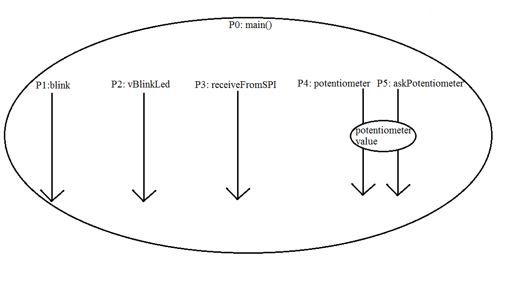

Aici este continut receptorul SPI. 

Codul din rutina pentru receptor, impreuna cu bibliotecile au fost preluate si/sau adaptate dupa: 
http://www.mikrocontroller.net/articles/NRF24L01_Tutorial

Mai jos sunt prezentate procesele ce se doresc a fi folosite in receptor (toate vor trebui sa functioneze in paralel):

